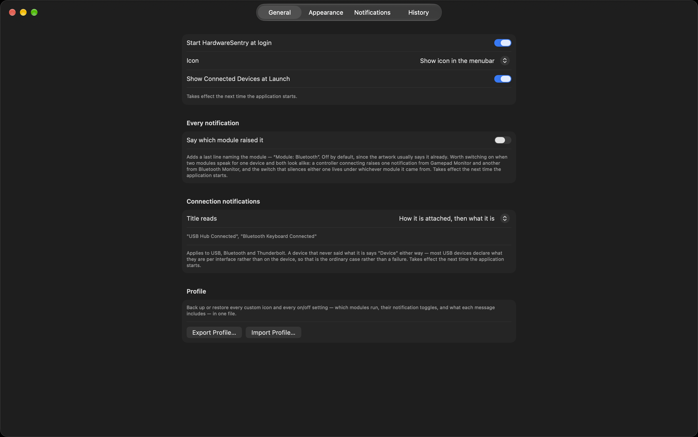

# HardwareSentry

A menu-bar application that watches the hardware attached to a Mac and says when something
changes — a drive plugged in, a display waking, the Wi-Fi network switching, the machine
starting to throttle because it is hot.

Requires macOS 15 or later. Apple Silicon.

**Status:** pre-release, version 0.1.0. Every module below is ported and covered by the
parity audit; see `CHANGELOG.md` for what has landed so far and `KNOWN-ISSUES.md` for what
is understood, small, and not yet worth holding a release for.



## What it does

Thirteen modules, each watching one kind of hardware: USB, Thunderbolt, Bluetooth, network,
Wi-Fi, displays, volumes, power, thermal state, audio devices, cameras, printers, game
controllers, and network scanners.

Each raises notifications you can switch on and off individually, and each message can
carry extra detail lines you choose. `Help ▸ HardwareSentry Help` documents every module,
notification and setting; that reference is generated from the modules themselves, so it
describes what the build in front of you actually does.

## It draws its own notifications

The banners are drawn by the application rather than handed to macOS. Handing a
notification to the system means giving up control of the corner, the size, how long it
stays and what it is drawn on, and it makes the application depend on a permission the user
has to grant. The trade-off is that these notifications do not appear in Notification
Centre and Do Not Disturb does not silence them.

## Permissions

Two, both only because macOS requires them to read something specific, and neither used for
anything else:

- **Bluetooth** — needed to see Bluetooth devices connecting at all.
- **Location** — needed only to read the *name* of the Wi-Fi network being joined. macOS
  treats a network name as a location. The actual location is never read.

The Scanner module also triggers the Local Network prompt, which is why it ships switched
off.

## Building

```
xcodegen generate
xcodebuild -project HardwareSentry.xcodeproj -scheme HardwareSentry -configuration Release build
```

Tests live in the `HardwareSentryCore` and `SignalCore` packages:

```
cd HardwareSentryCore && swift test
cd SignalCore && swift test
```

A third check compares what this application can notify about against HG4MAC, so nothing
is quietly lost in the rewrite:

```
Tools/parity-audit.sh [path-to-HG4MAC]
```

It exits non-zero on a gap. See `PARITY.md` for what it covers and what it cannot.

## Documentation

- `CHANGELOG.md` — what has been built so far, module by module.
- `KNOWN-ISSUES.md` — small, understood defects and open design questions, kept out of
  the code they affect.
- `PARITY.md` — what the parity audit covers, and what it structurally cannot.
- `SECURITY.md` — this project's security scope, and how to report a vulnerability.
- `Help ▸ HardwareSentry Help`, inside the application itself — generated from the
  modules, so it always describes the build in front of you.

## Licence

GNU General Public License v3 — see `LICENSE`.

## Attribution

HardwareSentry is an independent Swift rewrite. Its notification wording, the set of
hardware facts it reports, and its current placeholder artwork derive from HardwareGrowler,
part of The Growl Project, which is distributed under the BSD 3-Clause licence. That licence
permits the reuse and requires the notice be retained; `THIRD-PARTY-NOTICES.md` reproduces it
in full and sets out precisely what is derived and what is not.

The Growl Project does not endorse this application.

## Trademarks

Bluetooth® is a registered trademark of Bluetooth SIG, Inc. Wi-Fi® is a registered
trademark of Wi-Fi Alliance. Thunderbolt and the Thunderbolt logo are trademarks of Intel
Corporation. USB Type-C® is a registered trademark of USB Implementers Forum. Used here to
identify the hardware being reported on; no affiliation or endorsement is claimed.
